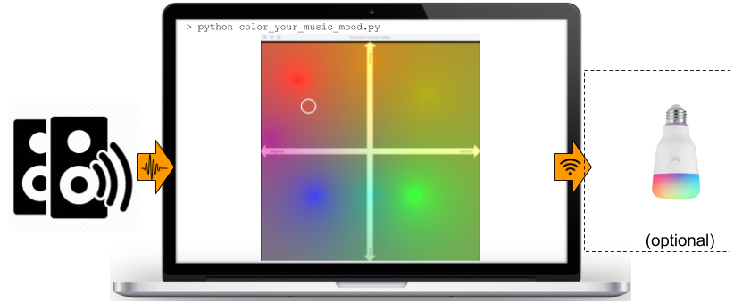

# color_your_music_mood
This demo records sound and - when music is detected - it estimates the 
underlying mood (emotion) and based on that it generates a respective color. 
If available, it can even set your Yeelight Bulb color (again based on 
the detected musical mood)

[Checkout this hackernoon article for more details on the implemented methodology and experimentation](https://hackernoon.com/how-to-use-machine-learning-to-color-your-lighting-based-on-music-mood-bi163u8l)

# Video Demo

# How it works
The basic steps of this demo are the following:
1. Sound is recorded from the computer's microphone. 
2. Every 5 seconds, the recorded audio segment is fed as input to two music emotion classifiers: 
   - Valence, that expresses if the emotion is negative or positive
   - Energy, that expresses how strong an emotion is
3. Valence and Energy are represented in a 2D plane where Valence is the x-axis and Energy the y-axis. 
4. A set of predefined points and colors is used do build the 2D colorspace. This set is defined as follow:
   - each pair of (point, color) is used to "paint" the 2D colorspace
   - all intermediate points are painted using a normalized linear combination of the predefined colors (based on the intermediate points' eucledian distances from the predefined colors)
5. The estimated Valence-Arousal pair for each 5-second music segment can be now represented with a particular color based on the 2D colored space. 
6. The same color can be used to illuminate the smart Yeelight Bulbs, if available.

# Some details on the used classifiers
  - A music vs non-music classifier is applied as a first step
  - Estimation of music emotional energy and valence is achieved through a simple SVM model
  - The music classifiers have been trained on hand-crafted audio features, based on around 5000 audio training samples. 
  - All trained models are included in this repo.
   
# Dependencies
 - Connection to the Yeelight Bulbs is achieved using this library https://yeelight.readthedocs.io/en/latest/
 - Audio analysis is performed using [pyAudioAnalysis](https://github.com/tyiannak/pyAudioAnalysis)
